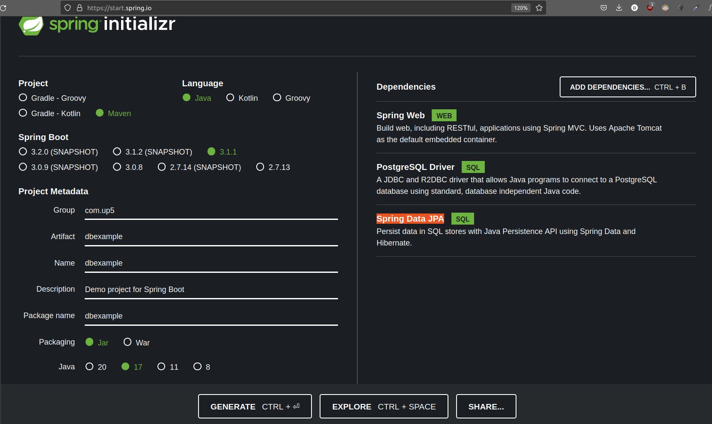

Springboot Project CRUD API

Date: 18/07/2023. Time wasted: 2 days

- Lần đầu tiên thử Spring Boot + Code Editor Intellij CE. Mọi thứ ban đầu rất khó khăn nhưng cũng vượt qua
## Dự án có gì?
- Kết nối Spring boot với postgres Sử dụng `PostgreSQL Driver` và `Spring Data JPA`
- Viết CRUD (Đọc, ghi, sửa, xóa) API 


## Các bước tiến hành
- Khởi tạo docker postgres trong folder docker. Tạo file .env thêm thông tin và khởi chạy docker

```bash
docker compose up -d
```
- Tạo setup trên trang (https://start.spring.io/)[https://start.spring.io/]. 



- Click Generate, download code và giải nén. Dùng Intellij mở dự án
- Setup kết nối database sử dụng file `application.property`. Đây là bước đầu tiên, quan trọng nhất. Làm sai sẽ không kết nối được server, khỏi làm gì nữa
- Viết Model `Product`
- Tạo interface `ProductRepository`
- Trong folder controller, tạo ProductController và viết các hàm đọc, ghi, sửa xóa

## Nâng cấp

- Xác thực sử dụng JWT
- HTTPS (Springboot hỗ trợ tốt hơn FastAPI)
- CI-CD
- Kết nối Frondend

## Tham khảo
1. https://www.youtube.com/watch?v=UMePnyjr6FM
2. https://start.spring.io/
3. 